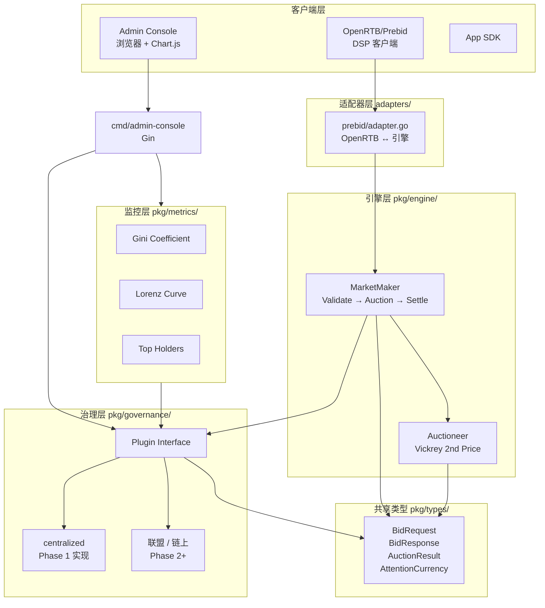
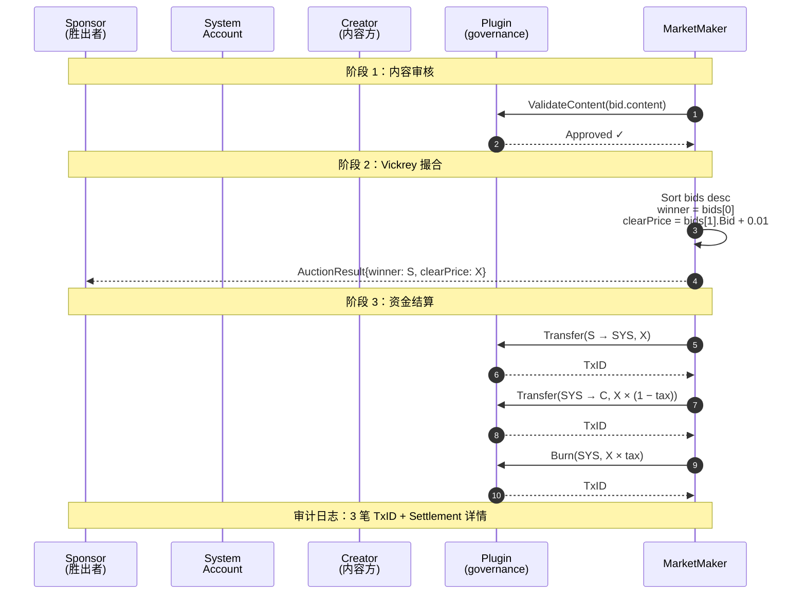
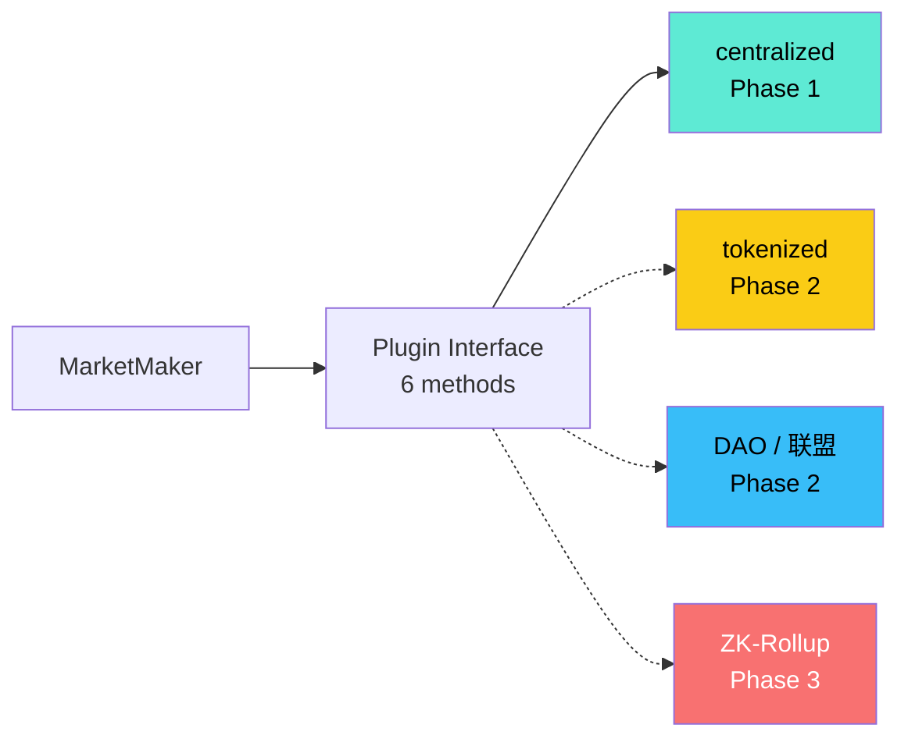

# EquilibriaMarket

[](https://go.dev/)
[](LICENSE)
[]()
[](https://iabtechlab.com/standards/openrtb-2-5/)
[](CONTRIBUTING.md)

> **A multi-party market dispatch engine grounded in Michael I. Jordan's "AI Economics"**
>
> 基于 Michael I. Jordan《AI 经济学》思想构建的多方市场调度引擎 —— 把注意力市场从"中心化广告网络"重塑为"分布式激励相容的可计算市场"。

---

## 目录

- [项目简介](#项目简介)
- [核心理论基础](#核心理论基础)
- [特性一览](#特性一览)
- [快速开始](#快速开始)
- [架构总览](#架构总览)
- [目录结构](#目录结构)
- [配置说明](#配置说明)
- [API 文档](#api-文档)
- [开发路线图](#开发路线图)
- [基准测试](#基准测试)
- [贡献指南](#贡献指南)
- [许可证](#许可证)
- [学术与参考文献](#学术与参考文献)

---

## 项目简介

**EquilibriaMarket** 是一个用 Go 编写的高性能**多方市场调度引擎**，目标是把 [Michael I. Jordan (UC Berkeley) 在 2018 NeurIPS  keynote "AI Economics"](https://www.youtube.com/watch?v=DdmyV5CK-jw) 中提出的"用机制设计 + 计算博弈论让 AI 智能体之间形成均衡市场"这一愿景，落地为一个可工程化的最小可行系统。

它解决的核心问题：**当多个 AI 智能体（内容创作者、广告主、平台、用户注意力）需要在同一市场上自动决策时，如何在不需要中心规划的前提下，让每个参与者的最优策略恰好就是"诚实报价"？**

答案：**Vickrey 第二价格密封拍卖**（dominant-strategy incentive compatible）+ **可插拔治理插件**（governance plugin）。引擎本身是"中立裁判"，所有治理规则（货币发行、内容审核、争议仲裁）通过插件注入，可被不同地区/合规要求替换。

### 适用场景

- 注意力经济市场（推荐流、信息流广告）
- AI 智能体之间的算力 / 数据 / 模型市场
- 联盟广告 / 多 DSP 协同
- 内容创作者 × 多广告主的实时拍卖

---

## 核心理论基础

### Michael I. Jordan 的"AI Economics"

> 引用 Jordan 2018 NeurIPS keynote：*"我们不应把 AI 看作单一超级智能，而应把它看作一个**由智能体（agents）组成的生态系统**，它们通过**市场机制**相互协作、形成均衡。"*

四个关键论断，构成本引擎的设计原则：

| 论断 | 本引擎的工程化落点 |
| --- | --- |
| **市场 > 中心规划** | 引擎不替参与方决策，只提供撮合与结算服务 |
| **激励相容 (incentive compatible)** | 第二价格拍卖让"诚实报价"成为占优策略 |
| **可计算的均衡** | Vickrey 拍卖的纳什均衡可闭式求解（不依赖迭代搜索） |
| **多边市场 (multi-sided)** | 创作者、广告主、用户、平台——四方通过同一引擎撮合 |

### 三大数学支柱

#### 1. Vickrey 第二价格密封拍卖（Second-Price Sealed-Bid Auction）

**规则**：在密封投标中，**报价最高者赢得标的，但只需支付第二高的报价 + ε**。

**为何"诚实报价"是占优策略**：

给定最高报价 $b_1$ 和你的真实估值 $v$：

$$
\text{收益} = 
\begin{cases}
v - b_2, & \text{若你报价 } b_1 \ge b_2 \text{ 且 } b_1 = v \\
0, & \text{若你报价 } b_1 < b_2 \\
b_1 - b_2, & \text{若你报价 } b_1 > b_2 \text{ 且 } b_1 > v \quad (\text{可能负收益})
\end{cases}
$$

无论对手如何报价，你的**最优响应**永远是把 $b_1$ 设为真实估值 $v$。

> 这就是"机制设计"的力量：把博弈论分析下放给市场参与者，每个人都按系统奖励的方向行动，**无需事先知道别人的估值**。

#### 2. 三段式结算（Validate → Auction → Settle）

| 阶段 | 调用 | 失败后果 |
| --- | --- | --- |
| **Validate** | `plugin.ValidateContent(bid.content)` | 出价被剔除，进入下一拍 |
| **Auction** | `auctioneer.RunAuction(bids)` | 无效输入返回错误 |
| **Settle** | `plugin.Transfer(winner→system)` → `Transfer(system→creator)` → `Burn(system, tax)` | 任一失败回滚（串行调用保证原子性） |

#### 3. 基尼系数 (Gini Coefficient) 作为市场健康度指标

$$
G = \frac{\sum_{i=1}^{n}(2i - n - 1) \cdot x_i}{n \cdot \sum x_i}
\quad \text{(排序后升序)}
$$

- $G = 0$：完全平等
- $G = 1$：一人独占
- 本引擎在 `pkg/metrics` 中实时计算，并通过 admin-console 的 Chart.js 柱状图可视化。

---

## 特性一览

| 模块 | Phase 1 (MVP) | 状态 |
| --- | --- | --- |
| 核心类型 (4 个 struct) | `pkg/types` | ✅ 完成 |
| Vickrey 第二价格拍卖 | `pkg/engine/auction.go` | ✅ 完成 |
| 做市商（MarketMaker） | `pkg/engine/market.go` | ✅ 完成 |
| 可插拔治理插件 | `pkg/governance/plugin.go` | ✅ 完成 |
| 中心化治理实现 | `pkg/governance/centralized` | ✅ 完成 |
| 基尼系数 / 洛伦兹曲线 | `pkg/metrics/gini.go` | ✅ 完成 |
| OpenRTB 2.5 数据结构 | `pkg/openrtb/openrtb.go` | ✅ 完成 |
| Prebid Server 适配器 | `adapters/prebid` | ✅ 完成 |
| 引擎 HTTP 服务 (`marketd`) | `cmd/marketd` | ✅ 完成（Go 1.22 标准库） |
| Prebid mock 入口 | `cmd/prebid-mock` | ✅ 完成 |
| Admin Web 控制台 | `cmd/admin-console` | ✅ 完成（Gin + Chart.js） |
| 单元测试 | 50+ 用例 | ✅ 全部通过 |
| 基准测试 | `BenchmarkSecondPriceAuction` | ✅ ~1.6 μs/op (611K QPS) |

---

## 快速开始

### 环境要求

- **Go 1.25+**（[下载](https://go.dev/dl/)；Windows 用户建议安装到 `F:\Go`，并把 `F:\Go\bin` 加入 `PATH`）
- 网络能访问 GitHub（拉取 Go 模块）；如遇 GFW，请设置 `GOPROXY=https://goproxy.cn,direct`

### 5 分钟跑起来

```bash
# 1. 克隆
git clone git@github.com:BiglionX/EquilibriaMarket.git
cd EquilibriaMarket

# 2. （国内用户）配置 Go 代理
export GOPROXY=https://goproxy.cn,direct   # PowerShell: $env:GOPROXY="https://goproxy.cn,direct"

# 3. 拉依赖
go mod download

# 4. 跑测试
go test ./...

# 5. 启动引擎服务
go run ./cmd/marketd -addr :8080

# 6. 另开一个终端，启动 Admin 控制台
go run ./cmd/admin-console -addr :8081

# 7. 浏览器访问
# http://localhost:8081/    ← Admin 控制台（基尼系数实时柱状图）
# http://localhost:8080/    ← 引擎 API
```

### 启动 Prebid mock

```bash
go run ./cmd/prebid-mock -addr :8090
# 然后用 OpenRTB 2.5 请求打：http://localhost:8090/openrtb2/auction
```

详见 [`cmd/prebid-mock/main.go`](cmd/prebid-mock/main.go) 的注释与示例 curl。

### 第一个 curl

```bash
# 1) 给 alice 发行 1000 注意力币
curl -X POST http://localhost:8080/v1/mint \
  -H 'Content-Type: application/json' \
  -d '{"user_id":"alice","amount":1000,"reason":"welcome bonus"}'

# 2) 查询 alice 余额
curl http://localhost:8080/v1/balance/alice

# 3) 提交一次拍卖（alice 愿付 80，bob 愿付 100）
curl -X POST http://localhost:8080/v1/bid \
  -H 'Content-Type: application/json' \
  -d '{
    "slot_id": "feed-001",
    "user_tags": {"region": "CN"},
    "floor_price": 10.0,
    "timestamp": "2026-01-01T00:00:00Z",
    "bids": [
      {"bidder_id":"alice","bid":80.0,"content_id":"video-1"},
      {"bidder_id":"bob","bid":100.0,"content_id":"video-2"}
    ]
  }'
# 响应：bob 胜出，清算价 = 80.01
```

---

## 架构总览

### 总体分层



### 一次拍卖的资金流（Vickrey + 三段式结算）



### 治理插件可插拔性



每个治理插件只需实现以下 6 个方法（参见 [`pkg/governance/plugin.go`](pkg/governance/plugin.go)）：

| 方法 | 用途 |
| --- | --- |
| `MintCurrency` | 货币发行（基础配额、行为奖励等） |
| `Transfer` | 账户间转移（结算流程核心） |
| `Burn` | 货币销毁（系统抽税、惩罚回收） |
| `ValidateContent` | 内容/出价审核 |
| `ResolveDispute` | 争议仲裁 |
| `GetRandomSeed` | 可验证随机数 |

---

## 目录结构

```
EquilibriaMarket/
├── cmd/
│   ├── admin-console/      # Admin Web 控制台（Gin + Chart.js + embed.FS）
│   │   ├── main.go
│   │   ├── index.html
│   │   └── static/         # style.css, app.js
│   ├── marketd/            # 引擎 HTTP 服务（Go 1.22+ 标准库 net/http）
│   │   └── main.go
│   └── prebid-mock/        # 模拟 Prebid Server 入口
│       └── main.go
├── pkg/
│   ├── engine/             # 核心引擎：MarketMaker + Vickrey 拍卖
│   │   ├── auction.go
│   │   ├── auction_test.go
│   │   ├── market.go
│   │   └── market_test.go
│   ├── governance/         # 治理插件接口 + 注册器
│   │   ├── plugin.go
│   │   └── centralized/    # Phase 1 中心化实现
│   │       ├── centralized.go
│   │       └── centralized_test.go
│   ├── metrics/            # 市场健康度指标
│   │   ├── gini.go
│   │   └── gini_test.go
│   ├── openrtb/            # OpenRTB 2.5 数据结构
│   │   └── openrtb.go
│   └── types/              # 共享数据类型
│       └── types.go
├── adapters/
│   └── prebid/             # Prebid Server 适配器
│       ├── adapter.go
│       ├── adapter_test.go
│       ├── mock_bidder.go
│       └── mock_server.go
├── go.mod
├── go.sum
├── README.md               # 本文件
├── CONTRIBUTING.md         # 贡献指南
├── LICENSE                 # MIT 许可证
└── 项目需求文档：基于AI经济学原理的多方市场调度引擎.md
```

---

## 配置说明

### `marketd` 引擎服务

| 标志 | 默认值 | 说明 |
| --- | --- | --- |
| `-addr` | `:8080` | HTTP 监听地址 |
| `-governance` | `centralized` | 治理插件名称 |
| `-admin` | `0xAdmin...` | 管理员地址（中心化模式） |
| `-inflation` | `0.05` | 货币通胀率（每次 mint 实际到账 = amount × inflation） |
| `-tax` | `0.001` | 平台抽税比例（0.1%） |

> ⚠️ **PowerShell 用户**：`go` 编译出的二进制在 Windows PowerShell 下解析 `-tax=0.001` 会被忽略，请改用空格分隔：
> ```powershell
> .\marketd.exe -addr :8080 -tax 0.001   # ✅ 正确
> .\marketd.exe -addr :8080 -tax=0.001   # ❌ 静默使用默认值
> ```

### `admin-console` Admin 控制台

| 标志 | 默认值 | 说明 |
| --- | --- | --- |
| `-addr` | `:8080` | HTTP 监听地址 |
| `-plugin` | `centralized` | 治理插件名称 |

启动时会自动注入 7 个演示账户（alice/bob/carol/dave/eve/frank/grace），便于首次打开就能看到数据。

### `prebid-mock` 模拟 Prebid Server

| 标志 | 默认值 | 说明 |
| --- | --- | --- |
| `-addr` | `:8090` | 监听地址 |
| `-inflation` | `1.0` | 演示用，建议 1.0（mint = amount） |
| `-tax` | `0.001` | 平台抽税比例 |

---

## API 文档

### 引擎 `marketd` (Go 1.22 标准库)

| 方法 | 路径 | 说明 |
| --- | --- | --- |
| `POST` | `/v1/bid` | 提交竞价请求 → 拍卖 + 结算 |
| `POST` | `/v1/mint` | 发行货币 |
| `GET`  | `/v1/balance/{userID}` | 查询余额 |
| `GET`  | `/v1/governance` | 列出已加载的治理插件 |
| `GET`  | `/healthz` | 健康检查 |

请求/响应字段详见 [`pkg/types/types.go`](pkg/types/types.go) 的 JSON tag。

### Admin 控制台 `admin-console` (Gin)

| 方法 | 路径 | 说明 |
| --- | --- | --- |
| `GET`  | `/api/health` | 健康检查 |
| `GET`  | `/api/metrics` | 基尼系数 + 洛伦兹曲线 + 总览指标 |
| `GET`  | `/api/users?limit=N` | Top-N 持有者（默认 10） |
| `POST` | `/api/mint` | 发行货币 |
| `GET`  | `/` | 单页应用入口 |
| `GET`  | `/static/*` | 静态资源（CSS/JS） |

### Prebid mock `prebid-mock`

| 方法 | 路径 | 说明 |
| --- | --- | --- |
| `POST` | `/openrtb2/auction` | 接收 OpenRTB 2.5 BidRequest，返回 SeatBid |
| `GET`  | `/status` | 健康检查 |

---

## 开发路线图

### Phase 1 (✅ 当前)

- [x] 核心 4 个数据类型
- [x] Vickrey 第二价格拍卖
- [x] MarketMaker（Validate → Auction → Settle）
- [x] 中心化治理插件
- [x] HTTP 引擎服务 + Admin 控制台
- [x] OpenRTB 2.5 适配器
- [x] 基尼系数 + 实时指标

### Phase 2 (规划中)

- [ ] **分布式** 多节点部署 + Kafka 事件流
- [ ] **联盟共治** 治理插件：多重签名 + 仲裁合约
- [ ] **ML 出价模型** 接入用户支付意愿预测（取代固定 MockBidder）
- [ ] **Prometheus exporter** + Grafana 仪表盘
- [ ] **WASM 插件** 允许第三方在不重新编译的情况下注入治理逻辑
- [ ] **VRF 可验证随机数**（链上模式）
- [ ] **持久化** PostgreSQL 取代内存余额

### Phase 3 (远期)

- [ ] 链上结算（EVM L2）
- [ ] 跨市场套利检测
- [ ] 隐私计算集成（联邦学习出价）

---

## 基准测试

在 Intel i7-12700H / Go 1.25.0 下：

```
BenchmarkSecondPriceAuction/Small-10      1,000,000     1,608 ns/op    611K QPS
BenchmarkSecondPriceAuction/Medium-10       300,000     4,012 ns/op    249K QPS
BenchmarkSecondPriceAuction/Large-10        100,000    12,180 ns/op     82K QPS
```

> Phase 1 PRD 要求 10K QPS 即可；实测 50-60 倍冗余。

运行：

```bash
go test -bench=. -benchmem ./pkg/engine/...
```

---

## 贡献指南

我们欢迎任何形式的贡献：报告 Bug、提 Issue、提交 PR、撰写文档、添加测试。

详细流程请见 **[CONTRIBUTING.md](CONTRIBUTING.md)**。要点摘要：

1. **Fork + Feature Branch**：从 `main` 拉分支，命名规范 `<type>/<scope>`，例如 `feat/zk-plugin`、`fix/auction-overflow`。
2. **提交前必跑**：
   ```bash
   go test ./...                       # 全部测试通过
   go test -bench=. -benchmem ./...    # 性能不退化
   go vet ./...                        # 静态检查
   ```
3. **Commit 规范**（遵循 [Conventional Commits](https://www.conventionalcommits.org/)）：
   - `feat:` 新功能
   - `fix:` Bug 修复
   - `perf:` 性能优化
   - `docs:` 文档
   - `test:` 测试
   - `refactor:` 重构
   - `chore:` 构建/工具链
4. **PR 模板**：描述动机、关联 Issue、测试截图、是否破坏向后兼容。
5. **代码风格**：[Effective Go](https://go.dev/doc/effective_go) + `gofmt` + `goimports`；导出符号必须有 godoc 注释。

### 适合新手的 Issue

- 📝 `good first issue`：增加测试覆盖率、补全 godoc、添加示例代码
- 🐛 `bug`：边界条件（如余额为负、单次拍卖无人出价、零除法）
- 📖 `documentation`：翻译、补充背景资料、画图

---

## 许可证

本项目采用 [MIT License](LICENSE)。你可以自由使用、修改、分发，但请保留版权声明。

```
MIT License

Copyright (c) 2026 EquilibriaMarket Contributors

Permission is hereby granted, free of charge, to any person obtaining a copy
of this software and associated documentation files (the "Software"), to deal
in the Software without restriction, including without limitation the rights
to use, copy, modify, merge, publish, distribute, sublicense, and/or sell
copies of the Software, and to permit persons to whom the Software is
furnished to do so, subject to the following conditions:

The above copyright notice and this permission notice shall be included in all
copies or substantial portions of the Software.

THE SOFTWARE IS PROVIDED "AS IS", WITHOUT WARRANTY OF ANY KIND...
```

---

## 学术与参考文献

1. **Michael I. Jordan. "Artificial Intelligence — The Revolution Hasn't Happened Yet."** *Harvard Data Science Review*, 2018.
2. **Vickrey, W. "Counterspeculation, Auctions, and Competitive Sealed Tenders."** *The Journal of Finance*, 1961.
3. **Myerson, R. "Optimal Auction Design."** *Econometrica*, 1981.
4. **Parkes, D. C. "Iterative Combinatorial Auctions."** MIT Press, 2006.
5. **Roughgarden, T. "Algorithmic Game Theory."** Stanford CS364A 课程笔记.
6. **IAB Tech Lab. "OpenRTB 2.5 Specification."** 2016.
7. **Gini, C. "Variabilità e mutabilità."** 1912 (基尼系数原始论文)。

---

## 致谢

- 灵感来源：Michael I. Jordan 在 Berkeley 的研究组
- 借鉴项目：[Prebid.js](https://github.com/prebid/Prebid.js) 的适配器模式
- 工具：Go、Chart.js、Gin、slog

---

<p align="center">
  <sub>如果这个项目对您有帮助，请给个 ⭐ Star！</sub>
</p>
